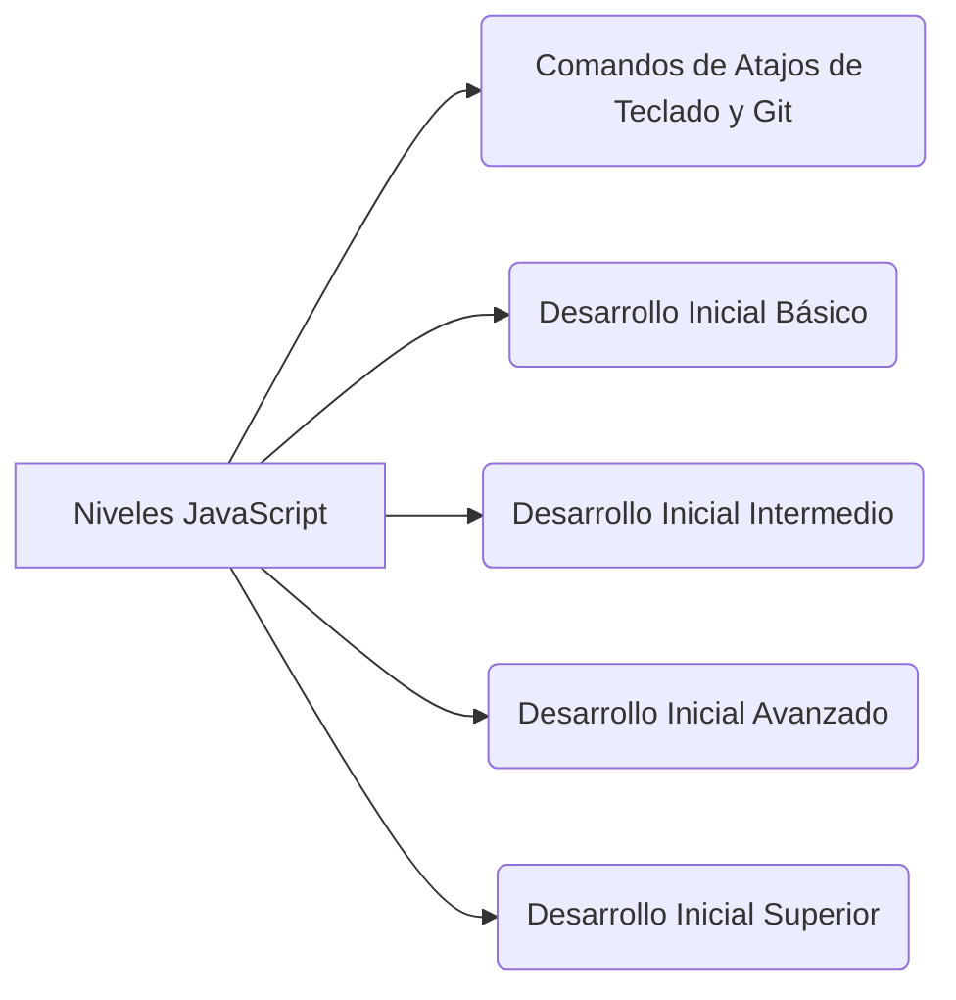

   # Resumen_FrontEnd_Inicial_2020
- Plantilla con Descripción básica para proyectos de FrontEnd

  

 

   <h2>Indice</h2>
    <tr>
       <td>&nbsp;&nbsp;&nbsp;&nbsp;&nbsp;&nbsp;  </td>
      </tr> 
    <tr>
        <td>&nbsp;&nbsp;&nbsp;&nbsp;&nbsp;&nbsp;</td>
      </tr> 
       <tr>
        <td>&nbsp;&nbsp;&nbsp;&nbsp;&nbsp;&nbsp;</td>
      </tr> 
       <tr>
        <td>&nbsp;&nbsp;&nbsp;&nbsp;&nbsp;&nbsp;</td>
      </tr> 
    

      

## [1 - Niveles JavaScript](https://github.com/DragonFenixOwi/Resumen_FrontEnd_Inicial_2020/tree/master/js)

   ### Comandos de Atajos de Teclado y Git 

   1.  **Plantilla EMMET Básica** Atajos mas Comunes de montaje rápido de etiquetas del "index.html" en Visual Studio Code

   2.  **Extensiones (Plugins)** mas Comunes en Visual Studio Code

   3.  **Atajo de teclado** Básico para Visual Studio Code
                
   4.  **Integrar Git_Bash** a la Terminal de VSCode
            
   5.  Iniciando el mundo de Git

   6.  Comando Generales de Terminal. 

   ###  Desarrollo Inicial Básico

   1.  **Valores Booleanos**

   2.  **Operadores**   

   3.  **Variables**, **Constante** y  **Valores**. 

   4.  **Funciones**
    
   5.  **Scope**
 
   6.  **Hoisting**

   7.  **Buenas Prácticas**

   8.  **Debil Tipado**
  
   9.  **Coerción** 

   ###  Desarrollo Inicial Intermedio

   1. **Visualización de datos**  

   2. **Array**

   3. **Métodos Array**

   4. **Objetos.**

   5. **Métodos Strings**

   6. **Módulo Math**

   7. ***Condicionales.***

   8. **Bucles**

   9. **Arrow Function**

   ###  Desarrollo Inicial Avanzado.

   1. **lineas de acción de JavaScript (Dinamismo y Aplicación)**
        - **1RA** -  Líneas de Acción DOM - Dinamismo HTML Y CSS
        - **2DA** - Aplicación (me falta)

 

   ###  Desarrollo Inicial Superior.

1.  **Programación Orientada a Objetos** (**POO**)

2.  **Estructura de una Clase**

    - Antes del **ECMAScript** de 2015
    - Despues del **ECMAScript** de 2015
    
3.  **Asincronismo**

    - Promesas vs Callback's

    - Sintaxis promesas (con y sin arrow function)

    - Esquema de XML - JSON - YAML 

    - Iniciar y ejecutar Node.js

    

### Actualización ECMAScript.
1.  **Resumen General**

    
2.  **Parámetros y Concatenación**

4.  **Desestructuración**   

5. **Spread Operador**                 
                                                 
6. **var, let y const**                
                                                      
7. **Arrow function**                

8. **Promesas**                    
            
9. **Clases**                        
        
10. ¿ Qué salio en **ECMAScript7** ?
    

11. ¿ Qué salio en **ECMAScript8** ?

    
12. ¿ Qué salio en **ECMAScript 9** ?

   ##  [2 - Primeros pasos con CSS](https://github.com/DragonFenixOwi/Resumen_FrontEnd_Inicial_2020/tree/master/css)

   1.  **CSS_Descripción** (Importantes: Páginas de Desarrolladores y descripción detallada "estilos.css")
   
   2.  **Estilos.css** (descripción corta de las líneas de código utitilizadas)

   3.  **Main_Axis-Column**

   4.  **Main_Axis_Row** 
    

   ## [3 - Registro Complementario](https://github.com/DragonFenixOwi/Resumen_FrontEnd_Inicial_2020/tree/master/Registro%20Complementario)
   

   ###  - Recopilación de Imagenes

   - **CallBack** (Suma, Date)

   - **FlexBox** - Responsive - FirexFox Developer

   - **JSON**

   - **Solución** - No ejecuta console.log en Chrome

   - **UI-UX**.
   
   - **Debugger**

   ###  - PDF

   

   ## [Descripción Ruta de Aprendizaje del frontend](https://github.com/DragonFenixOwi/Resumen_FrontEnd_Inicial_2020/tree/master/Registro%20Complementario/PDF%20-%20Ayuda)

1.  **Git**

2. **Terminal** –zsh

3. **Programación Básica**
    - Conceptos básicos de que es
    - Un poquito de que es la memoria. “Hardware"
4. En Paralelo UI/UX (**Wireframe**)
    - Tener alquien de UI/UX especializado en un grupo
    - Es importante, asi no nos damos tanta vuetla
    - Lo interesante es que nos puedan hacer un wireframe
    - Y luego pueda desarrollar el mockup dentro del wireframe

5. **Desarrollo web**
    - Hml5 css3

6. **Responsive Desing**
    - Flexbox grids

7. **Frameworks**
    - Muchas de ellas requieren de "bootstrap"
    - Serian
        - "bootstrap"
        - “Foundation”
        - “Bulma”
    - ¿Qué hacen?
         - Te hacen un sistema de trabajo
        - Con varios desarrrolladores es importante
    - ¿que pasa?
        - Al unir en git es un caos

8. PRE- PROCESADORES
    - Se pensaba que iban a desaparecer
    - Los navegadores se toman muy tranquilo esta
    - Serian
        - SASS
        - Less
        - Styles
    - SASS para mi es el mejor
    - El pre-procesador crearía con este lenguaje
    - Con SASS no perdeis
        - Con SASS siempre tenemos un super enganches
        - Poder hacer bucles
        - Variables
        - Temas del lengueja
        - Concatena con CSS .Pero con superpoderes
    - ¿Qué pasa con el pre-procesador?
        - Necesitamos un software que procese
        - Necesitamos un plugin en vscode
    - Pre-procesador
    - Si pones en Internet pre-procesador Aplicación
    - Cuando se controla todo esto pasas

9. **Vanilla JavaScript**

10. **Node.js**
    - Fuera del navegador
    - Utiliza el motor V8, pasa de código al código maquina muy rápido
    - Convierte al JS a modular
    - Estoy fuera del navegador y puedo tener un servidor

11. **Base de datos**

12. TS – **TypeScript**

13. **Base de datos**
    - MySQL es de Oracle. Lo compro y por eso dejo de ser open source
    - Una empresa que hay que pagar
    - MySQL
        - MariaDB es el clon de MySQL
        - Porque MySQL es open source
    - JavaScript con su parte de servidor
        - Node.js
        - Y Base de datos
    - Ahora viene TypeScript
        - JavaScript con super poderes
        - Puedes meterte ahora?
            - No
            -  Necesitas saber los anteriores
    - FRAMEWORKS de JavaScript

14.  **REACT**
        - React Native
            - ANDROID
            -  IOS
        - React
            - Es un frameworks
          -  Y luego tenes React Native
                -  En otros lenguajes con
        - **Otros**
            -  Vue.js
                -  No es de empresas tan grandes
                -  Pero será el futuro
                -  Es un framework muy agradable
